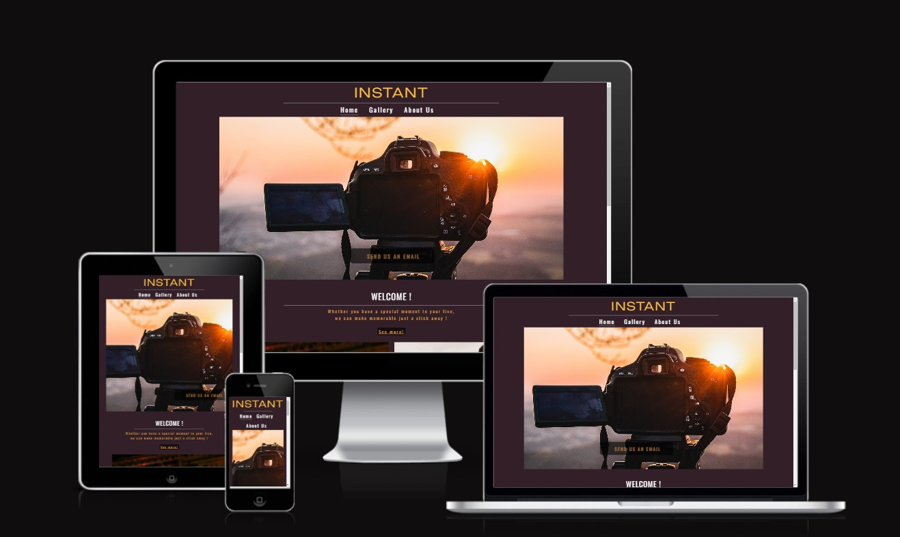
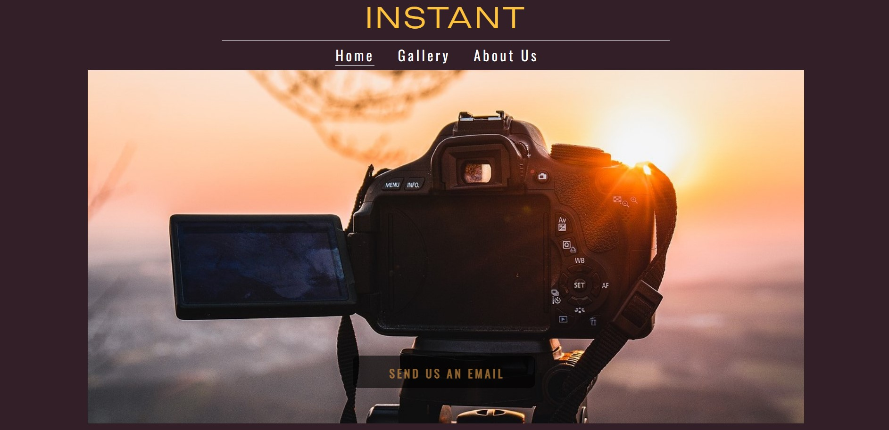
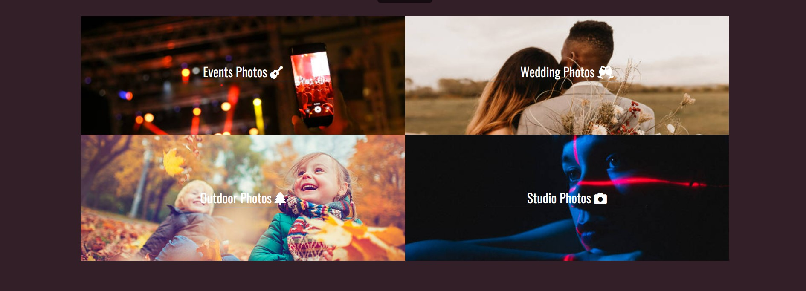
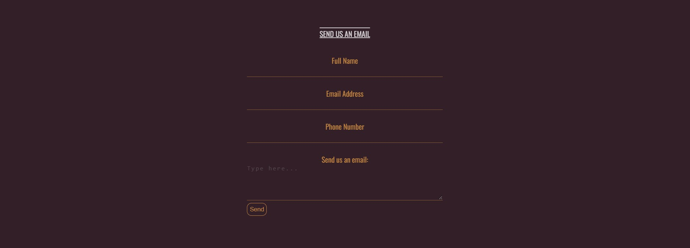
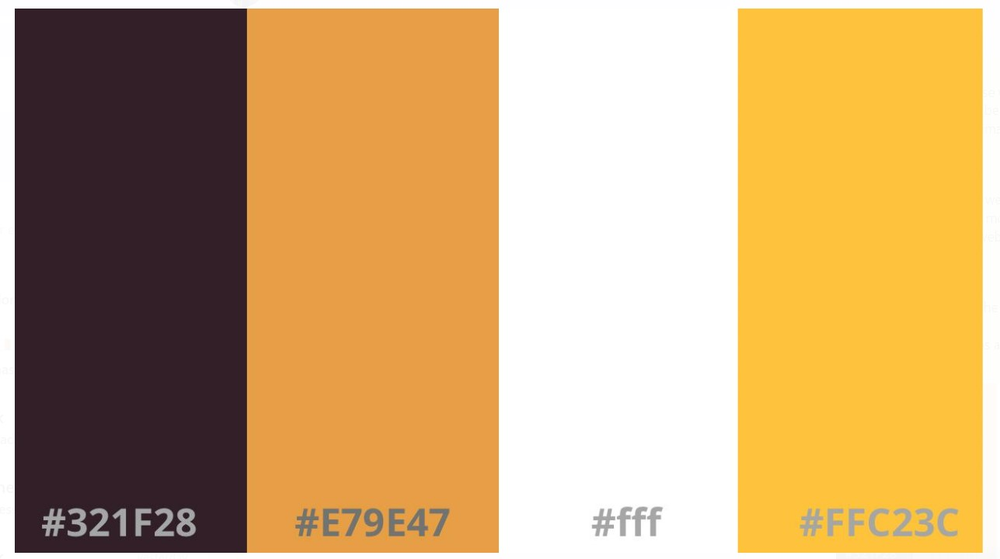
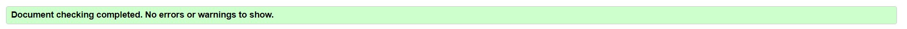
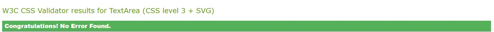
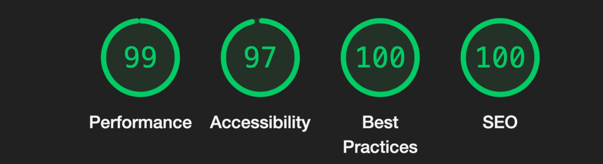

# INSTANT photographer websiter - A   Milestone Project

My first milestone project, undertaken as part of the Code Institutes Diploma in Software Development. 

# Who Is This Website For?

I  have created this website for people who are looking for the services of professional photographer, either for photo shooting for evets, weddings or any memorable occasions.

The site is for any person located on Cork and looking for a photorapher.

The aim of this website is to increase the photographers potential online reach.

# UX - User Experience 
The project was planned in 5 stages. 
- Strategy Plane 
- Scope Plane 
- Structure Plane
- Skeleton Plane
- Surface Plane 

##  User Stories 

 - As a user I want to be able to easily reach out to the photographers.
-  As a user I want that the website to have a good portifolio of the photographer's work.
-  As a user I want that the site have easy navagation
- As a user I expect that the website would have a link to the social media profiles.

 ## The Owner 

- As the owner I want the website to be atractive to the user while displaying the work of the potographers
- As the owner I want the website to be easy to navigate.
- As the owner I want that the contact infomation and the social media be easy to locate 

# The Scope Plane
The features of this project:
3 pages
A home page with live links and a form 
1 page to include pictures and live links
1 page to have pictures and a article  about us along with live links

# The Structure Plane 
The website has a home page, gallery page and an about us  page The design of each page has been kept simplistic. 
The overall goal of the site is to only contain information which makes a positive impression without overwhelming the overall design. 

## Home Page 

 

From the moment you visit the website it is clear from the hero image it is a photographers website. The image has a contact us feature.

### Navigation 

Available in the header, just under the nameof the company, the navagation baris reponsiveand includes three-pages; 'Home', 'Gallery' and 'About us'. Allowing the user to easily navagate through the website. 

### Welcome 

A short paragraph that introduces a bit of the company for the user. Also has a link for the 'About us' page in case the user wants to know more about the company.

## Services

### Contact Us

The contact us feature is easy  located on the home page, if the user has any questions related to the company's services, such as price availabilty or certain styles.

### Footer

 

The footer has a simple layout, contaning only the social medias links and the phone number for contact.

## Gallery

A selection of pictures showing the photos "taken" by the photographer team.

## About Us

A page where the user can find more infomations about the company and the photograpers team.

# The Skeleton Plane 
The design of this project was to make the content simplistic to view on any screen size but being mobile friendly was also key. 
Below is a link to the wireframe I had completed 

[Wireframe Home Page](assets/image_readme/wireframe_home_page.jpg)

[Wireframe Gallery Page](assets/image_readme/wirekframe_gallery.jpg)

[Wireframe About Us Page](assets/image_readme/wireframe_about_us.jpg)

##  Color Palette 

I used the site colorhunt.co to bring together a colour pallet for the base of the website. The choice of the dark background was made so the photos on the website would be more visible and attacking, however not too dark therefore bringing a more positive image for the website as long with the two yellow tones to bring some love into the site.

## Fonts 

I used google fonts to discover and use fonts that would suit my website. I’ve chosen, Unbounded, cursive for the title of the website so I could bring a more professional looking and Oswald, sans-serif to complete the look of the INSTANT website

## Features for the future

Below are features that I would have liked to add but have been unable to do so yet due to time constraints and not having the knowledge to do so yet either.
 - I would like to add a page confirming the “email sent” for when the button submit on the form be clicked the page opens 
 - I would like to add a videos on the gallery page with more photos and videos of photography shooting

# Testing
 
 -  I have tested all the link on the website, to make sure they are working.
 -  At first when I was adding the font, they were not working on the site. I searched as to why this may have been and found that I had not placed the media link into the CSS file.
 - I have tested the responsiveness of the website,i have tested the look good on every size screen.
 -  I have confimed that the form works,  requies entry on every file.

  ## Validator 

  HTML

  CSS
 
  Accesibility 
  

# Technologies used
- [HTML5](https://en.wikipedia.org/wiki/HTML) for markup 
- [CSS3](https://en.wikipedia.org/wiki/CSS) for style 
- [Google Fonts](https://fonts.google.com/) for fonts 
- [Github]( https://github.com/) to keep the file 
- [Gitpod]( https://www.gitpod.io/) for version control
- [Colorhunt.co](https://colorhunt.co/) to build a colour palette for the site 
- [Font Awesome](https://fontawesome.com/v5.15/icons) for icons

# Resources
- [Code Institute](https://codeinstitute.net/) Course material
- [W3Schools]( https://www.w3schools.com/) 
- [Am I Responsive](http://ami.responsivedesign.is/) – Check the sites responsiveness
- [W3C](https://validator.w3.org/) Validate HTML code
- [W3C]( https://jigsaw.w3.org/css-validator/) CSS Validation 
- [W3Schools](https://www.w3schools.com/) - helped me in researching and fixing errors along the way

# Version Control 

- GitHub
- Gitpod

Gitpod served as the local repository and IDE. 
GitHUb served as the remote repository. 

The following steps were followed to maintain version control;

- I created a repository on GitHub and named it 'photography_website' 
- I then signed in to Gitpod and opened a new workspace via the repository name 'photography_website'
- I created the pages, folders and files on GitPod
- I saved my work on GitPod at regular intervals and pushed it to GitHub to keep it safe

This is the process I followed having completing each significant section of code, I typed the following into the terminal:
- git add . (This added the work to git)
- git commit -m "COMMIT MESSAGE" (This committed the work)
- git push (This pushed the work to GitHub)

# Deployment 

I followed the below steps on GitHub (insert link) to deploy the website. 

- Go to repository and select 'settings'. 
- Under the 'Github pages@ section, click on the live link. 
- On "Source", select "Branch: main' for Branch and click save.
- The website is now published on GitHub Pages and the link is provided on the same section